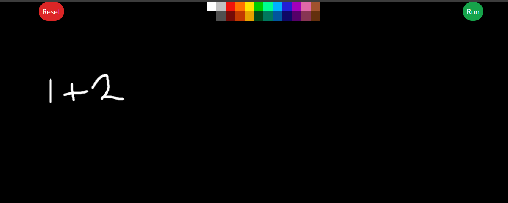
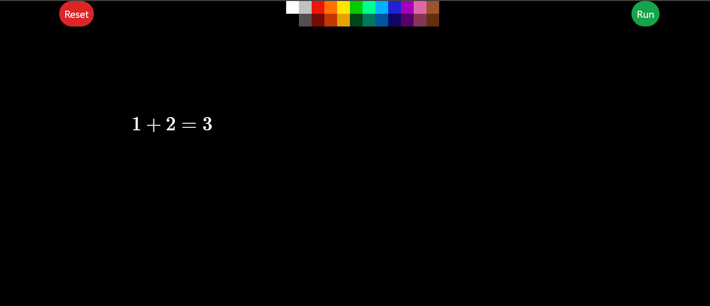
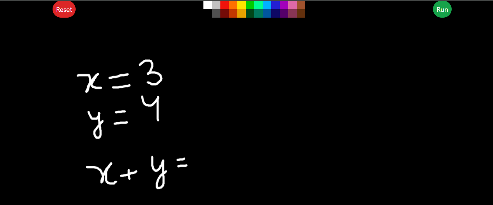
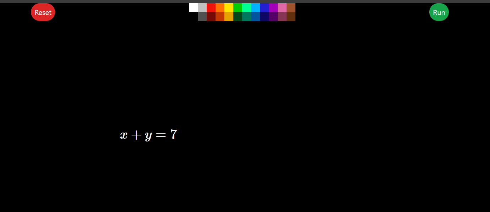
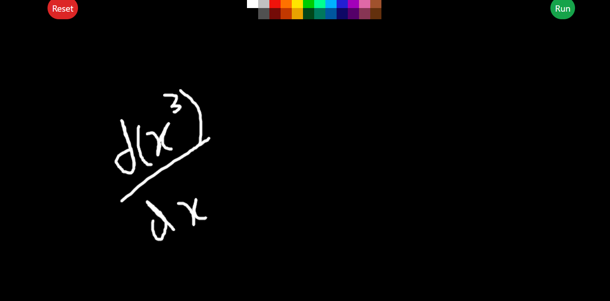
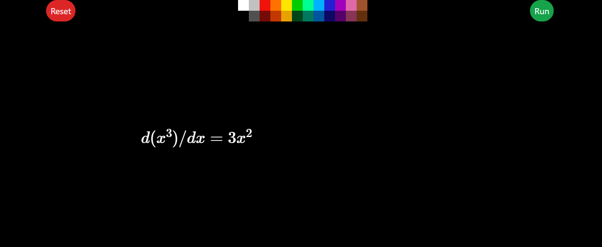
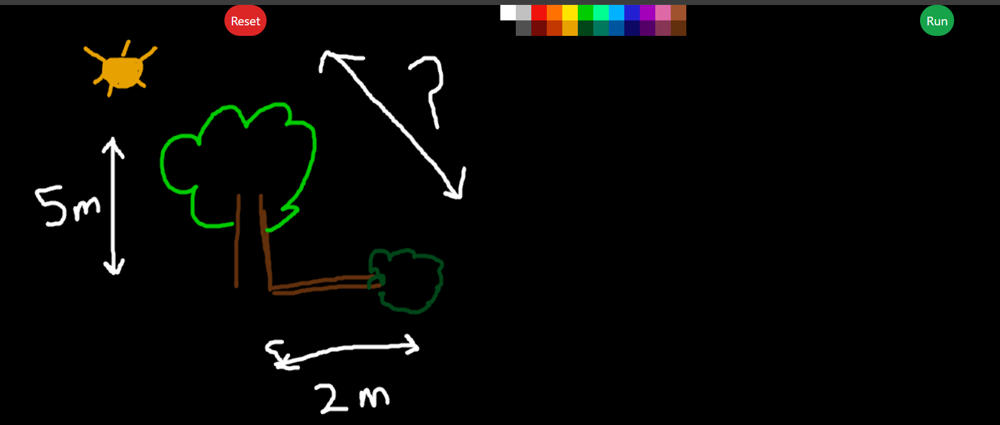
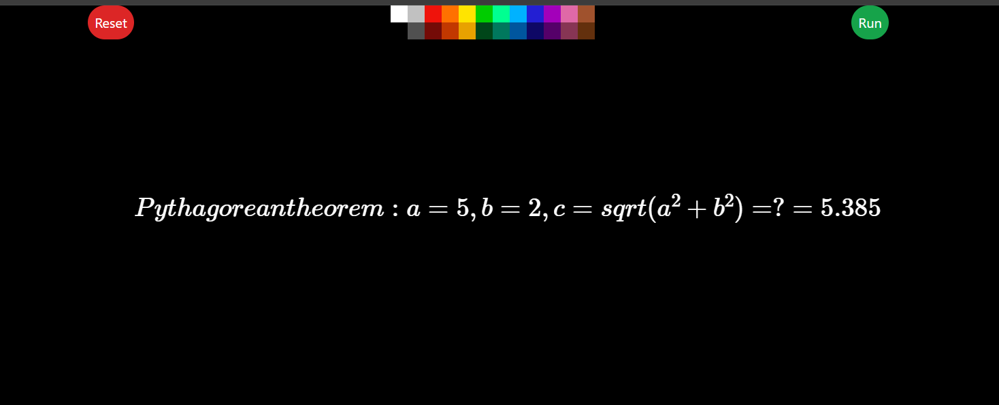

# 🧮 MathCanvas - Handwritten Math Equation Solver
MathCanvas is a web app that lets you draw math equations on a canvas, processes them using a FastAPI backend powered by Gemini 2.0 Flash, and displays the computed result using LaTeX rendering.

---

## ✨ Features
- 🎨 Draw equations with multiple colors
- 🧠 Uses Gemini 2.0 Flash to interpret handwritten equations
- 🧮 Supports variable assignment and expression evaluation
- 📐 Smart placement of results over canvas
- 🖱️ Draggable LaTeX output
- 🔁 Reset to clear all equations and results

---

## 🖼️ Frontend
### Tech Stack:
- React + TypeScript
- TailwindCSS
- better-react-mathjax
- react-draggable
- Axios

### Setup:
```bash
cd frontend
npm install
npm run dev
```

Make sure to set the environment variable in `.env`:
```env
VITE_SERVER_URL=http://localhost:8000
```

---

## ⚙️ Backend
### Tech Stack:
- FastAPI
- Gemini 2.0 Flash (via Google Generative AI API)
- PIL (for image processing)
- Pydantic v2

### Setup:
```bash
cd backend
pip install -r requirements.txt
python -m uvicorn src.main:app --reload
```

Create a `.env` file for the backend:
```env
GOOGLE_API_KEY=your_gemini_api_key
```

---

## 🖌️ Usage
1. Select a color and draw your math equation on the canvas
2. Click the **Run** button to process the image
3. See the LaTeX-rendered equation and result appear on screen
4. Drag the result anywhere on the canvas
5. Click **Reset** to clear the canvas and variables

---

## 📁 Project Structure
```
/client     - React app with canvas, controls, and LaTeX display
/server      - FastAPI server with Gemini 2.0 Flash logic
```

---

## 📸 Examples

Press Run after drawing

### Basic Arithmetic
**Input (Handwritten):**


**Output (Processed with LaTeX):**


### Variable Assignment
**Input (Handwritten):**


**Output (Processed with LaTeX):**


### Advanced Mathematics
**Input (Handwritten):**


**Output (Processed with LaTeX):**


### Illustration Solving
**Input (Handwritten):**


**Output (Processed with LaTeX):**


---

## 🚀 Getting Started
1. Clone the repository
2. Set up the backend:
   ```bash
   cd server
   pip install -r requirements.txt
   # Add your GOOGLE_API_KEY to .env
   uvicorn main:app --reload
   ```
3. Set up the frontend:
   ```bash
   cd client
   bun install
   # Add VITE_SERVER_URL to .env
   bun run dev
   ```
4. Open your browser and start drawing equations!

---

## 🔧 Model Configuration
The application uses **Gemini 2.0 Flash** for enhanced performance and accuracy in handwritten equation recognition. Make sure your Google API key has access to the Gemini 2.0 Flash model.

---
